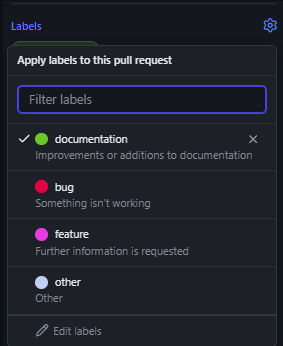

# Rota-Oeste-FrontEnd

## Como Contribuir
Para contribuir com o projeto, siga os passos abaixo:

1. **Crie uma branch**: Baseado na branch `main`, crie uma nova branch para suas modificações. Nomeie a branch de forma que ela reflita as mudanças que você está propondo. Utilize o seguinte comando:

    ```bash
    git checkout -b nome-da-sua-branch
    ```

2. **Faça suas alterações**: Implemente as modificações propostas em sua branch. Certifique-se de seguir as diretrizes de codificação e os padrões do projeto.

3. **Commit suas mudanças**: Após realizar suas alterações, faça o commit delas. Use mensagens de commit claras e descritivas que expliquem suas alterações. Você pode fazer isso com:

    ```bash
    git add .
    git commit -m "fix: modificação em x item"
    ```
Leia mais sobre como fazer uma mensagem de commit em: https://www.conventionalcommits.org/en/v1.0.0/

4. **Abra um Pull Request no Github**: Após subir suas alterações, abra um pull request e aguarde a revisão 🎉
Lembre-se de colocar uma mensagem na pull request e adicionar uma label para melhor identificação



## Links Úteis

### Documentações

Seguem os links de todas as documentações das tecnologias usadas nesse projeto:

- [Engenharia de Requisitos](https://pt.overleaf.com/read/frtcrbrscwgs#5915a5)
- [Modelagem de Banco de Dados](https://pt.overleaf.com/read/vdwdjvqvtwwr#5cba88)
- [WireFrame](https://miro.com/app/board/uXjVKgPil_Q=/?share_link_id=476697909317)
- [Figma](https://www.figma.com/design/nwaVccYxXjauVKnK2g10S5/Prototipagem---Desafio-da-Rota-Oeste?node-id=0-1&t=mXpimYtfWCtENctq-1)
