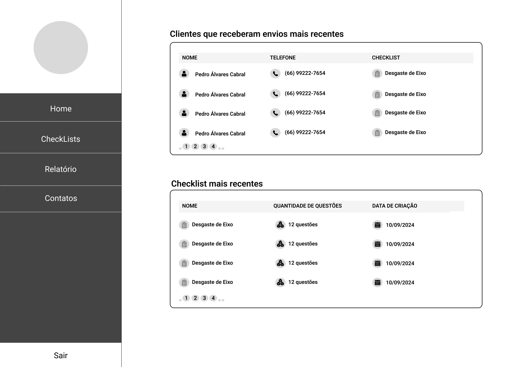

# Rota-Oeste-FrontEnd

## Visão Geral

Este projeto é o frontend da solução de comunicação integrada para a empresa Rota Oeste. Desenvolvido em **Flutter**, o aplicativo oferece uma interface intuitiva e responsiva para facilitar a interação e gestão de informações via WhatsApp. Integrado com a **API Wpp do Twilio** e conectado ao backend em **.NET Core**, o sistema proporciona uma experiência robusta e eficiente para os usuários da Rota Oeste, permitindo uma comunicação centralizada e ágil com clientes e parceiros.

## Proposta do Projeto

O frontend foi projetado para atender às necessidades de comunicação e controle da Rota Oeste, simplificando o envio e o acompanhamento de checklists e interações. As principais funcionalidades incluem:

- **Interface de usuário moderna e responsiva**: Desenvolvida em Flutter, garantindo excelente usabilidade e desempenho em diversas plataformas.
- **Gestão de checklists e interações**: Permite que os usuários criem, visualizem, editem e excluam checklists, facilitando o monitoramento de atividades e a comunicação com os clientes.
- **Integração com o backend**: Sincronização em tempo real com o backend em .NET Core para garantir confiabilidade e consistência dos dados.

## Tecnologias Utilizadas

| Tecnologia    | Descrição                                                                                       |
|---------------|-------------------------------------------------------------------------------------------------|
| Flutter       | Framework para o desenvolvimento do frontend, proporcionando uma experiência de usuário multiplataforma. |
| Twilio API    | Integração para comunicação via WhatsApp, permitindo envio e recebimento de mensagens diretamente no app. |
| .NET Core API | Interface RESTful para interação entre o frontend e o backend, garantindo a integridade e a segurança dos dados. |

## Principais Funcionalidades

- **Gestão de Checklists**: Criação, edição e exclusão de checklists para monitoramento de atividades e controle de fluxo de trabalho.
- **Interação via WhatsApp**: Utilizando a API do Twilio, o aplicativo envia e recebe mensagens para comunicação eficiente com clientes e parceiros.
- **Relatórios e Insights**: A aplicação oferece recursos de geração de relatórios detalhados para análise de interações e desempenho, auxiliando na tomada de decisões.

## Arquitetura do Sistema

O frontend foi desenvolvido com o Flutter, seguindo uma arquitetura modular que facilita a manutenção e a escalabilidade. A organização das camadas e componentes respeita o princípio de separação de responsabilidades, o que garante flexibilidade e facilidade de testes. A arquitetura é preparada para suportar futuras integrações e expansões da aplicação.

## Estrutura de Pastas

A estrutura do projeto foi organizada para melhorar a manutenção e a colaboração, com pastas principais para os componentes:

- **assets**: Armazena recursos de mídia, como ícones e imagens.
- **lib**: Contém o código principal do aplicativo, com widgets, páginas e lógica de negócio.
- **test**: Arquivos de teste para validar funcionalidades e garantir qualidade do código.

## Design de Médio Nível

- Página de Login:

- Home Page:

- Página de Gerenc. de CheckList:

- Página de Gerenc. de Contatos:

- Página de Gerenc. de Relatórios:

## Design de Alto Nível 

- Página de Login:

- Home Page:

- Página de Gerenc. de CheckList:

- Página de Gerenc. de Contatos:

- Página de Gerenc. de Relatórios:

## Metodologia de Desenvolvimento

O desenvolvimento do frontend segue a metodologia **Agile Scrum**, com sprints semanais para entrega de funcionalidades incrementais. Cada sprint inclui revisão e testes das novas funcionalidades para garantir a qualidade do produto e o alinhamento com os requisitos do projeto.

## Testes e Qualidade

A aplicação conta com uma suíte de testes automatizados para assegurar a qualidade das funcionalidades. Os principais tipos de testes incluem:

- **Testes Unitários**: Garantem a integridade de funções e componentes isolados.
- **Testes de Interface**: Validação da responsividade e funcionalidade da interface em diferentes dispositivos e tamanhos de tela.
- **Testes de Integração**: Verificam a comunicação do frontend com o backend através da API REST.

## Equipe de Desenvolvimento

Cada membro da equipe contribuiu com seu conhecimento e habilidades para garantir a qualidade e a funcionalidade do frontend do projeto. Abaixo estão as principais contribuições de cada um:

| Membro        | Função                | Contribuições                                           | Foto                                  |
|---------------|-----------------------|---------------------------------------------------------|----------------------------------------|
| Carlos        | Front-End + Design    | Desenvolveu o layout da interface e a navegação entre as telas, garantindo a experiência de usuário. |  |
| Anthony       | Product Owner + Design | Coordenou as tarefas e fez a ponte entre as equipes de design e desenvolvimento, garantindo a coerência no layout e usabilidade. |  |
| Alan Bruno    | Front-End + Integração | Implementou a integração com a API do backend e configurou os componentes de envio de mensagens via Twilio. |  |

## Links Úteis

### Documentações

- [Engenharia de Requisitos](https://pt.overleaf.com/read/frtcrbrscwgs#5915a5)
- [Modelagem de Banco de Dados](https://pt.overleaf.com/read/vdwdjvqvtwwr#5cba88)
- [WireFrame](https://miro.com/app/board/uXjVKgPil_Q=/?share_link_id=476697909317)
- [Figma - Prototipagem](https://www.figma.com/design/nwaVccYxXjauVKnK2g10S5/Prototipagem---Desafio-da-Rota-Oeste?node-id=0-1&t=mXpimYtfWCtENctq-1)

---

